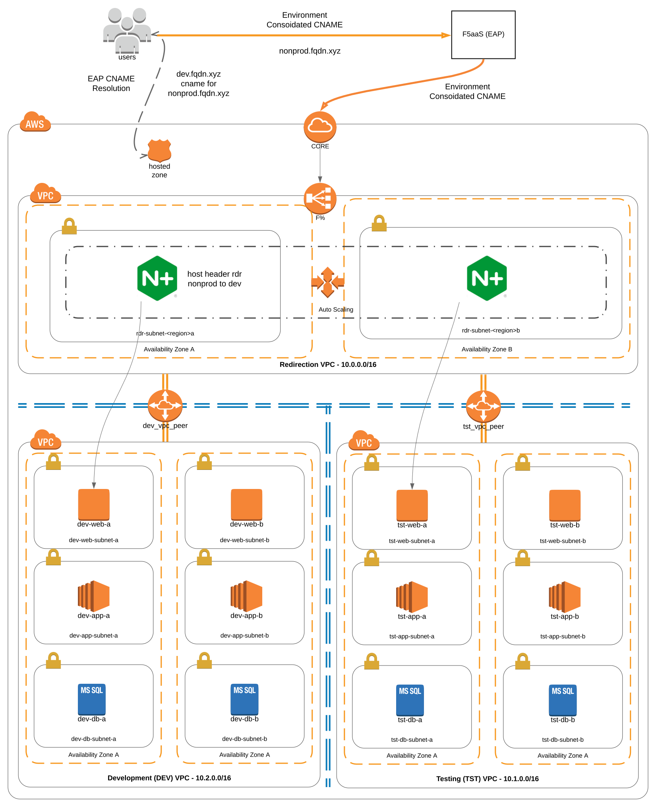

Deployment Example
------------------------------------------------

Selecting the Development environment for the purpose of this exercise, as seen in the diagram 
presented below, two isolated *vpc's* exist; dev & tst.

The suggested approach is the creation of an additional redirection *vpc*  that would accommodate an
autoscaling/autohealing group of NGINX instances.

.. note::  Creation of an additional AWS account for the purpose of the redirection vpc not only
simplifies provisioning but allows for fine grain control of environments.
