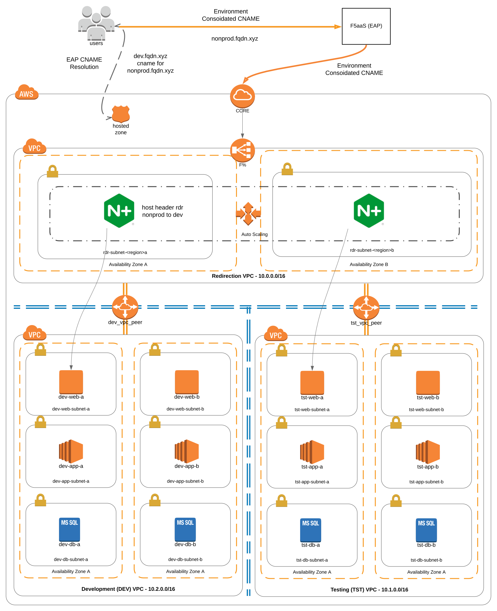

.. toctree::
   :titlesonly:
   :maxdepth: 4

Essential App Protect NGINX Redirect Example
**(WIP)**
================================================

Summary
------------------------------------------------

This paper is a theoretical, also practical, exercise in the consolidation of like applications for 
different environments.  These are generally seen across environmental application stacks for the 
purpose of testing all stages of the application life cycle.  

Broad examples could include the following:

* *Non-Production Environments*

  * User Acceptance Testing (UAT)
  * Quality Acceptance Testing (QAT)
  * System Integration Testing (SIT)

* *Development Environments*

  * Development (dev)
  * Testing (tst)

* *Production Environments*

  * Blue/Green deployment stacks
  * production stacks

This paper will demonstrate, using the development as an example environment pattern from the 
previous list, using NGINX to consolidate environment fqdn's for the purpose of grouping like 
applications and the simplification of EAP application policies for ease of management.

Deployment Example
------------------------------------------------

Selecting the Development environment for the purpose of this exercise, as seen in the diagram 
presented below, two isolated *vpc's* exist;

* dev
* tst

The suggested approach is the creation of an additional redirection *vpc*  that would accommodate an
autoscaling/autohealing group of NGINX instances.

.. note::  Creation of an additional AWS account for the purpose of the redirection vpc not only
           simplifies provisioning but allows for fine grain control of environments.

